## Google Cloud Setup

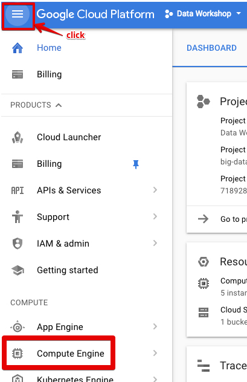
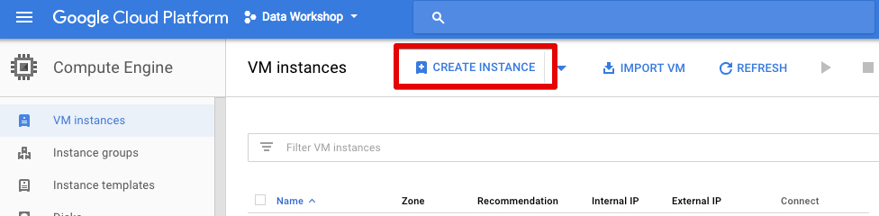

## (1) name
Just type a name for your instance, just someting sensible :)

## (2) select zones
Be aware, that usualy US zones chepear, than EU or Asia

## (3) machine type
Select how many CPU and RAM do you need. Btw, you can click "customize" and select in more flexible way.

## (4) Operation System
While in doubt, use Ubuntu 16.04 :)

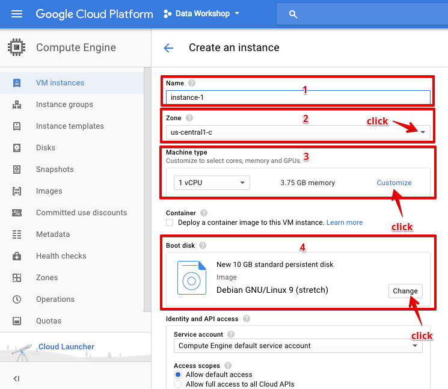
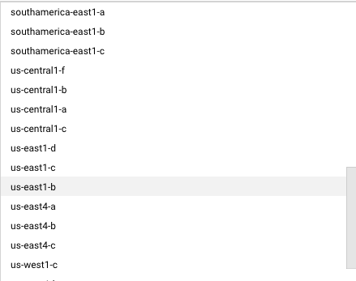
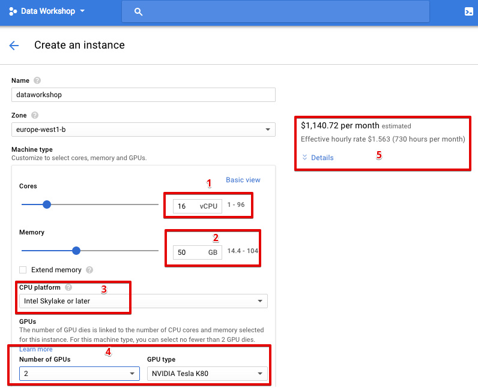
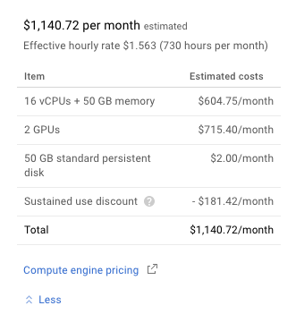
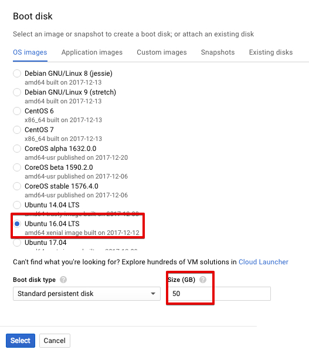
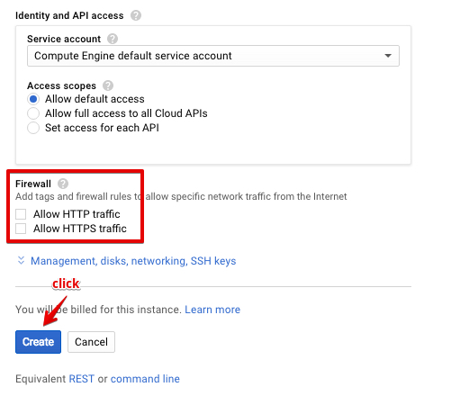

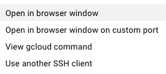
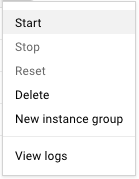

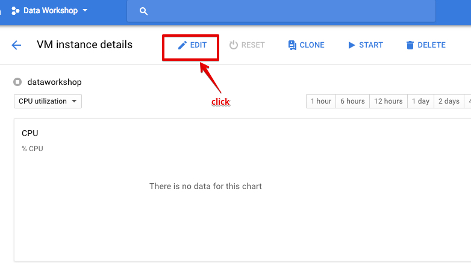
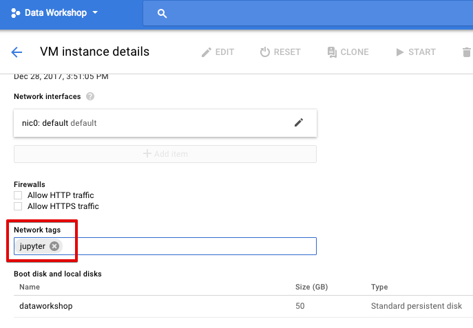
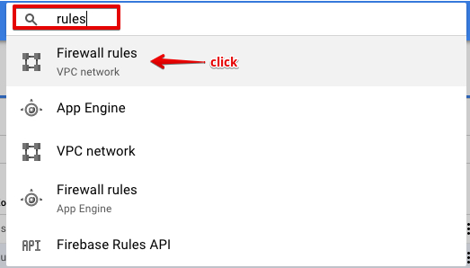
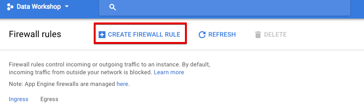
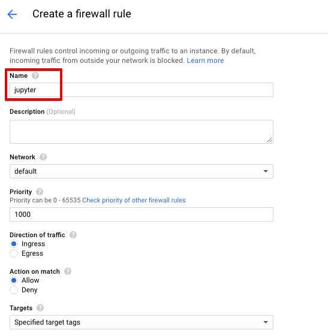
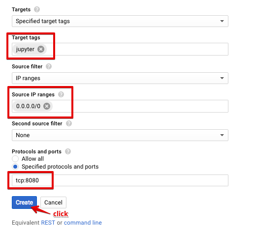